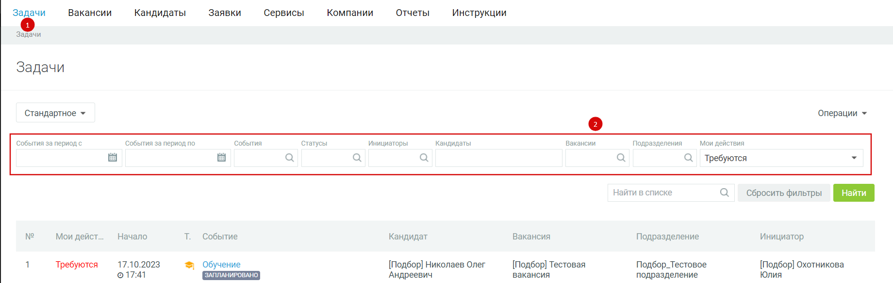

---
jupytext:
  text_representation:
    extension: .md
    format_name: myst
kernelspec:
  display_name: Python 3
  language: python
  name: python3
---

(mirapolis_ch01)=
# Описание функционала

## Описание общего функционала системы для пользователя

HR сотрудникам в Системе назначается роль «Рекрутер», в полномочия которой входит просмотр основных каталогов Системы, возможность создавать и согласовывать заявки на подбор, добавление, просмотр и изменение вакансий и всех кандидатов, создание и проставление решений по событиям подбора.

## Меню «Подбор персонала»
В рамках подбора персонала сотрудникам доступен раздел «Подбор персонала»:

:::{figure-md} mirapolis_ch01-01

Страница «Задачи»
:::
