---
jupytext:
  text_representation:
    extension: .md
    format_name: myst
kernelspec:
  display_name: Python 3
  language: python
  name: python3
---

(mirapolis_ch01)=

# Описание функционала системы для пользователя с ролью «Рекрутер», «Руководитель подбора»

+++

## Описание общего функционала системы для пользователя

HR сотрудникам в Системе назначается роль «Рекрутер», в полномочия
которой входит просмотр основных каталогов Системы, возможность
создавать и согласовывать заявки на подбор, добавление, просмотр и
изменение вакансий и всех кандидатов, создание и проставление решений по
событиям подбора.

+++

## Меню «Подбор персонала»

В рамках подбора персонала сотрудникам доступен раздел «Подбор
персонала»:

- **«Задачи»** (1) - страница, на которой отображаются все события
  подбора, доступные пользователю. На странице отображаются фильтры
  (2), по которым возможно совершать поиск по нужным событиям. Для
  этого введите или выберите в одном из фильтров значение и нажмите
  на кнопку «Найти». По умолчанию отображаются события, по которым
  от пользователя требуются действия:

:::{figure-md} mirapolis-image-001

Название рисунка
:::

- **«Вакансии»** (2) -- страница с каталогом вакансий, на которой
  отображаются все вакансии, доступные для просмотра сотруднику:

:::{figure-md} mirapolis-image-002
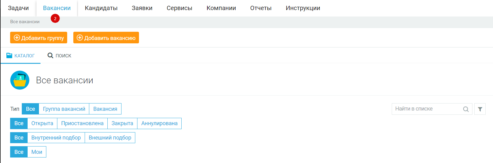

Название рисунка
:::

- **«Кандидаты»** (3) -- страница с каталогом кандидатов, на которой
  собраны все кандидаты, добавленные в Систему, кроме тех, к которым
  ограничен доступ:

:::{figure-md} mirapolis-image-003
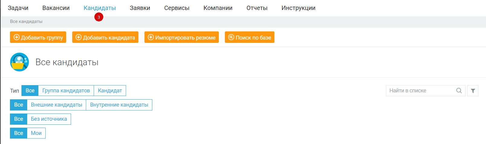

Название рисунка
:::

Помимо основной страницы с каталогом кандидатов, данный раздел меню
включает в себя:

- страницу «Рабочая база кандидатов» - для поиска кандидатов на
  вакансиях с использованием различных фильтров;

- страницу «Поиск по id кандидата» - для поиска кандидатов по
  уникальному значению идентификатора.

- **«Заявки»** (4) - страница, на которой собраны все заявки на подбор
  персонала:

- заявки на подбор, созданные сотрудником;

- заявки на подбор, по которым сотрудник является участником какого-либо этапа согласования;

- заявки на подбор, которые были поданы подчиненными сотрудниками пользователя.

:::{figure-md} mirapolis-image-004
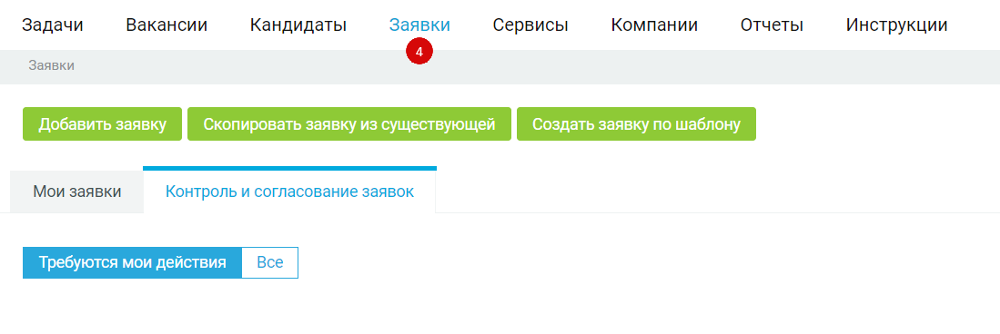

Название рисунка
:::

- **«Сервисы»** -- данный раздел содержит четыре пункта:

- «Поиск по базе» (5) -- страница для контекстного поиска по базе кандидатов;

- «Массовый импорт резюме» (6) -- страница, на которой пользователь может создать задачу для импорта нескольких резюме одновременно;

- «Места работы» (7) -- каталог Системы, который содержит информацию о прежних местах работы кандидатов.

:::{figure-md} mirapolis-image-005
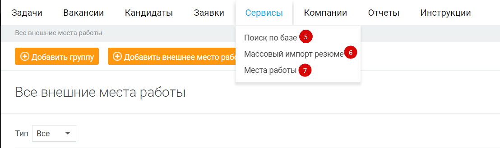

Название рисунка
:::

- **«Компании»** -- данный раздел содержит два пункта:

- «Компании» (8) -- каталог подразделений Системы, содержит информацию обо всех подразделениях, доступных пользователю.

- «Физические лица» (9) -- каталог физических лиц Системы, содержит информацию обо всех сотрудниках, доступных пользователю.

:::{figure-md} mirapolis-image-006
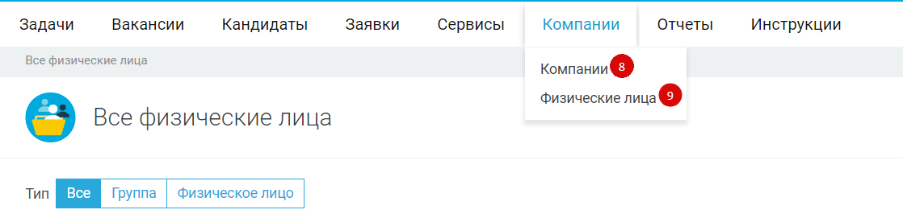

Название рисунка
:::

- **«Отчеты»** (10) -- каталог Системы, в котором содержатся все
  отчеты, доступные пользователю.

:::{figure-md} mirapolis-image-007
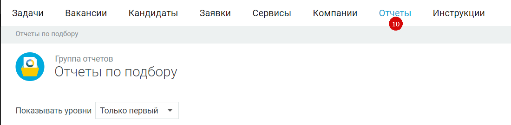

Название рисунка
:::

- **«Инструкции»** (11) -- страница, на которой пользователь может
  найти различные инструкции по работе с Системой.

:::{figure-md} mirapolis-image-008
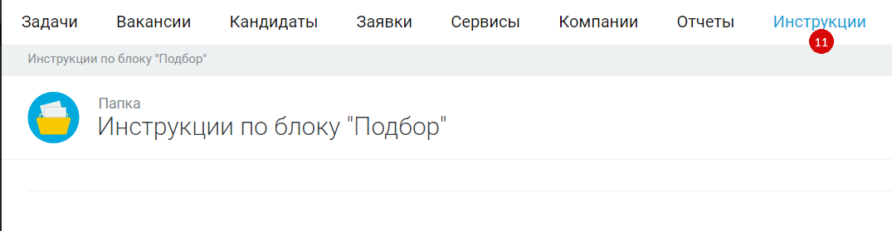

Название рисунка
:::

+++

## Профиль пользователя

+++

### Смена роли

Пользователю может быть назначена одна или несколько ролей в
зависимости от выполняемых функций:

- Сотрудник

- Обучающая организация

- Рекрутер

- Руководитель подбора

- Администратор подбора

Для переключения роли нужно:
1. Нажать на имя пользователя в правом верхнем углу (1)
2. В открывшемся списке выберите нужную роль, система переключиться на другую роль:

:::{figure-md} mirapolis-image-009
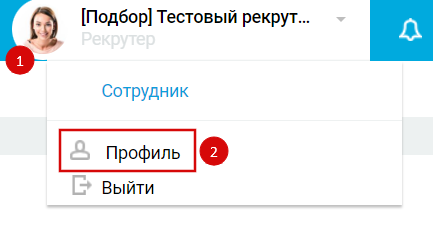

Название рисунка
:::

+++

### Добавление подписи

Для работы с кандидатами сотрудник может настроить себе подпись, которая
будет использоваться в письмах для кандидата.

Для добавления подписи:
1. Нажать на имя пользователя в правом верхнем углу (1). Нажмите на раздел «Профиль» (2):

:::{figure-md} mirapolis-image-009

Название рисунка
:::

2. В открывшемся профиле нажмите на кнопку «Изменить»:

:::{figure-md} mirapolis-image-010
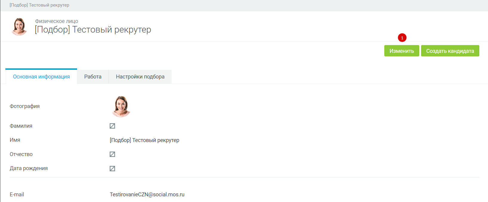

Название рисунка
:::

3. Перейдите на вкладку «Настройки подбора» (1) в раздел «Подписи» (2):

:::{figure-md} mirapolis-image-011

Название рисунка
:::

4. Заполните поле «Подпись» (1) и нажмите на кнопку «Сохранить» (2).
 Текст из этого поля будет отображаться на месте автоподписи при отправке писем кандидатам:

:::{figure-md} mirapolis-image-012
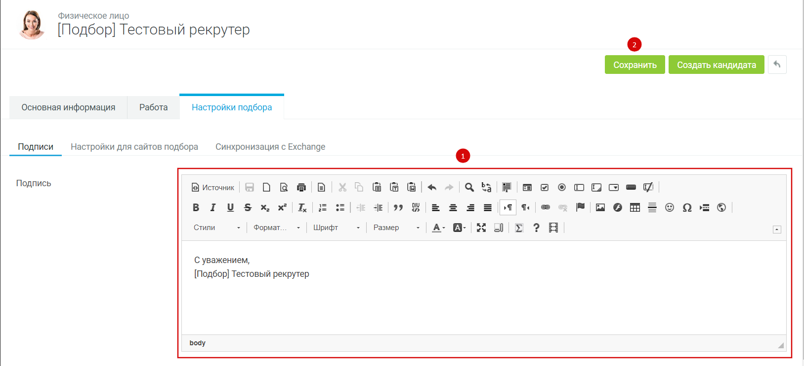

Название рисунка
:::

+++

### Авторизация на внешних работных сайтах и мессенджере Telegram

Для публикации вакансий на внешних работных сайтах и поиску кандидатов
пользователю потребуется пройти авторизацию.

Для этого:
1. Нажать на имя пользователя в правом верхнем углу (1). Нажмите на раздел «Профиль» (2):

:::{figure-md} mirapolis-image-009

Название рисунка
:::

2. В открывшемся профиле нажмите на кнопку «Изменить»:

:::{figure-md} mirapolis-image-010

Название рисунка
:::

3. Перейдите в группу вкладок «Настройки подбора» (1) на вкладку
 «Настройки для сайтов подбора» (2):

:::{figure-md} mirapolis-image-013
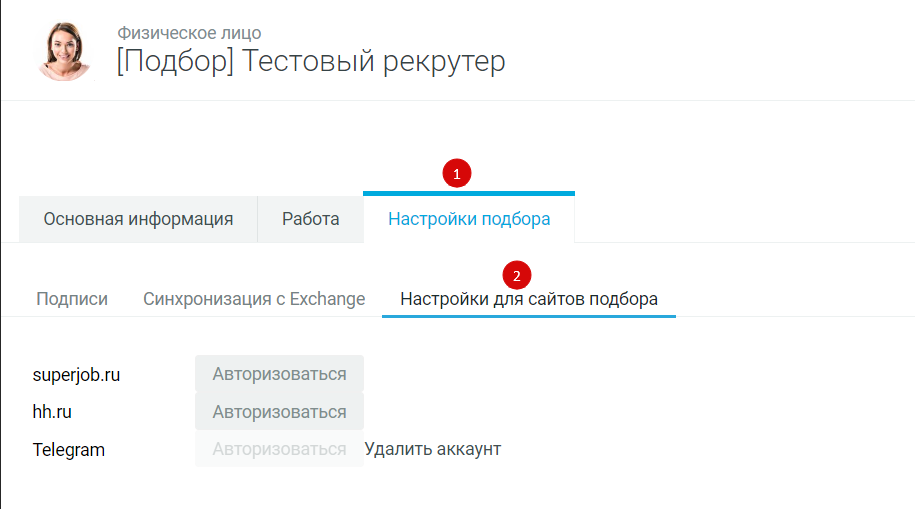

Название рисунка
:::

4. Для авторизации на внешнем работном сайте ([hh.ru](https://hh.ru/)
или [superjob.ru](https://www.superjob.ru/)) нажмите на кнопку «Авторизоваться» (1):

:::{figure-md} mirapolis-image-014
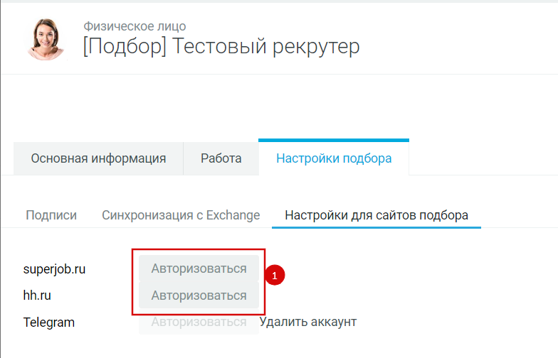

Название рисунка
:::

5. После этого система Вас перенаправит на страницу авторизации на работном сайте. На работном сайте откроется окно для авторизации, в котором Вам нужно ввести ваши логин/пароль от работного сайта и нажать на кнопку «Войти в личный кабинет» (1). В случае, если Вы уже были авторизованы на работном сайте, то появится окно с предупреждением вида «Использовать приложение «Мираполис HCM» пользователем ...», где Вам нужно нажать на кнопку «Продолжить».
 После этого Вы автоматически вернетесь на страницу своего профиля в
 Системе.

:::{figure-md} mirapolis-image-015
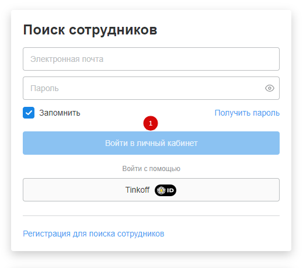

Название рисунка
:::

6. Для авторизации в мессенджере Telegram нажмите на кнопку
 «Авторизоваться» (1):

:::{figure-md} mirapolis-image-016
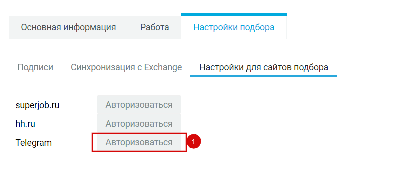

Название рисунка
:::

7. Откроется окно, в котором Вам нужно ввести номер телефона (1), к которому привязан профиль Telegram, для которого нужно пройти авторизацию. Далее нажмите на кнопку «Отправить код» (2).

:::{figure-md} mirapolis-image-017
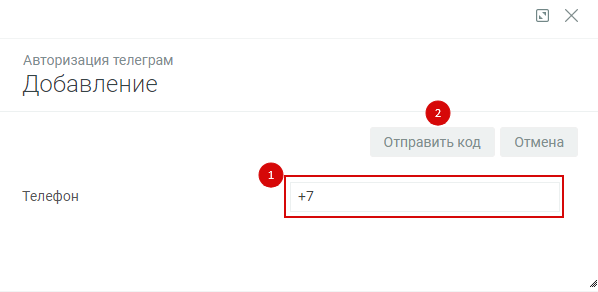

Название рисунка
:::

8. На Ваш аккаунт в Telegram придет код, который нужно ввести в поле
 «Код подтверждения из сообщения телегам» (1). Для завершения авторизации нажмите на кнопку «Сохранить» (2).

:::{figure-md} mirapolis-image-018
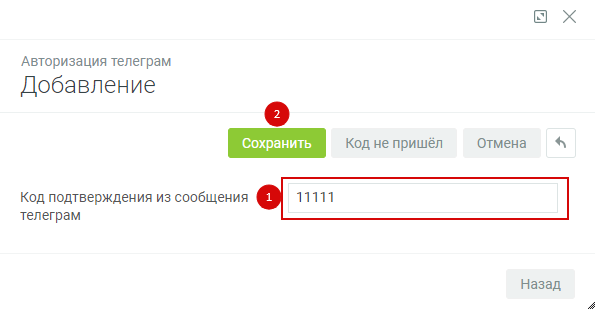

Название рисунка
:::

+++

### Синхронизация с Exchange

Перед началом работы с Системой пользователям с ролями Рекрутер и
Руководитель подбора необходимо включить синхронизацию с Exchange.
Включение синхронизации позволит добавлять события подбора в календарь
Outlook в виде встреч, а также смотреть свою занятость и занятость
заказчиков вакансий.
1. Нажать на имя пользователя в правом верхнем углу (1). Нажмите на раздел «Профиль» (2):

:::{figure-md} mirapolis-image-009

Название рисунка
:::

2. В открывшемся профиле нажмите на кнопку «Изменить»:

:::{figure-md} mirapolis-image-010

Название рисунка
:::

3. Перейдите на вкладку «Настройки подбора» (1) в раздел «Синхронизация с Exchange» (2) и нажмите на кнопку «Включить» (3) в параметре
 «Статус синхронизации».

:::{figure-md} mirapolis-image-019
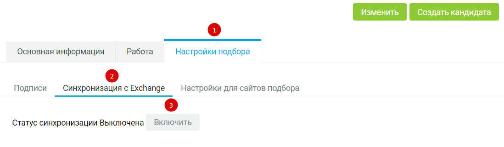

Название рисунка
:::

4. Откроется окно авторизации окно для ввода данных, в которое нужно ввести логин/пароль от почты и нажать «Вход».

:::{figure-md} mirapolis-image-020

Название рисунка
:::

5. Если данные введены корректно, статус изменится на «Включена» (1). В случае, если авторизация уже была пройдена ранее, то статус изменится на «Включена» без всплывающего окна.

:::{figure-md} mirapolis-image-021
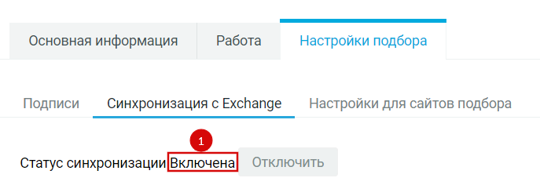

Название рисунка
:::

+++

## Установка плагина для импорта кандидатов в браузере Chrome

В рамках добавления кандидатов в Систему с работных сайтов (
[hh.ru](https://hh.ru/),
[superjob.ru](https://www.superjob.ru/), [linkedIn.com](https://linkedIn.com/)) HR сотрудник может воспользоваться плагином
для автоматического импорта резюме в Систему.

Для установки расширения нужно:
1. Скопировать и вставить в поисковую строку в браузере Google Chrome данную ссылку:
 <https://chrome.google.com/webstore/detail/%D0%BC%D0%B8%D1%80%D0%B0%D0%BF%D0%BE%D0%BB%D0%B8%D1%81-%D1%80%D0%B5%D0%BA%D1%80%D1%83%D1%82%D0%B5%D1%80/aideeiglpbknjghjdfkdhgkmpcllhaof>
2. Вы попадете на страницу расширения «Мираполис Рекрутер» (ver. 3.1.0 и выше) в интернет-магазин Chrome.

Нажмите на кнопку «Установить» (1).

:::{figure-md} mirapolis-image-022
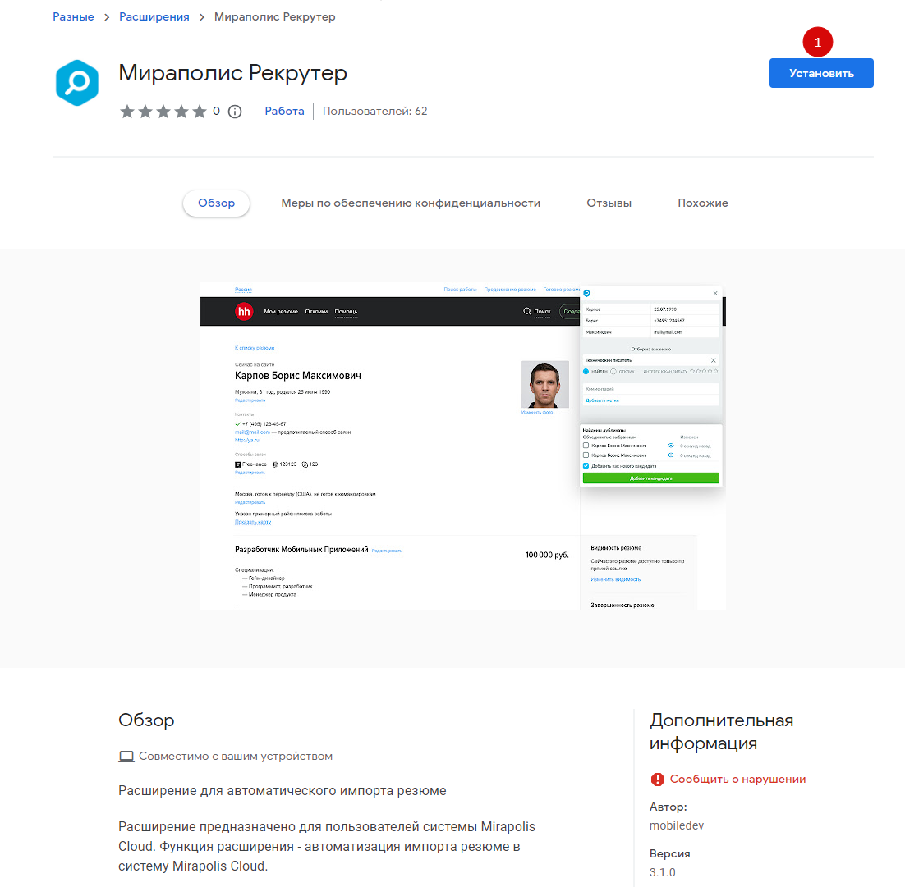

Название рисунка
:::

3. В модальном окне нажмите на кнопку «Установить расширение» (1).

:::{figure-md} mirapolis-image-023
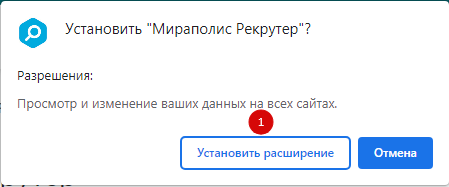

Название рисунка
:::

4. После установки расширения, откройте список расширений, нажав на значок мозаики (1). В списке установленных расширений нажмите на
 «Другие действия» (2) напротив расширения «Мираполис Рекрутер» и в открывшемся списке выберите «Параметры» (3).

:::{figure-md} mirapolis-image-024
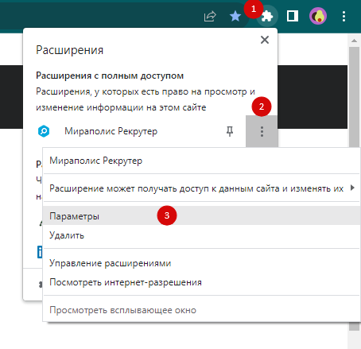

Название рисунка
:::

5. В параметрах расширения в поле «URL Вашей системы» укажите название системы - <https://hr-insz.mos.ru/mira/>. При необходимости также можно заполнить параметры «Выбирать вакансии для отбора кандидатов среди» и «Статус вакансии»:

- Параметр «Выбирать вакансии для отбора кандидатов среди» -- это фильтр, который при добавлении резюме кандидата в систему на вакансию позволит выбирать из всех вакансий, доступных пользователю, или только из вакансий, по которым пользователь является ответственным за вакансию.

- Параметр «Статус вакансии» -- фильтр, который при добавлении резюме кандидата в систему на вакансию позволит выбирать из вакансий, которые находятся в статусе, указанном в параметре.

Нажмите на кнопку «Сохранить».

:::{figure-md} mirapolis-image-025
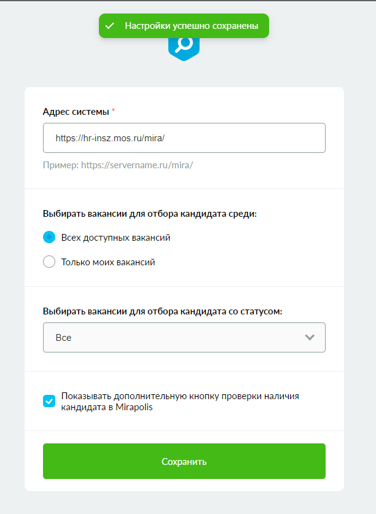

Название рисунка
:::

После сохранения Вы можете закрыть вкладку с параметрами расширения.

+++

## Работа с объектами системы

+++

### Карточка вакансии

В карточке вакансии HR сотруднику доступна следующая информация:
1. **Раздел «Работа по вакансии»** (1), в котором доступна краткая информация по кандидатам, отобранным на вакансию:

 -   ФИО кандидатов (2), при этом на вкладке все кандидаты разделены
     по группам статусов (3), в которых они находятся в текущий
     момент на вакансии;

 -   Ссылка на резюме кандидатов (4);

 -   Текущий статус кандидатов (5);

 -   Контактные данные кандидатов (6);

 -   Уровень интереса к кандидатам (7);

 -   В правой части страницы -- блок работы с кандидатом на вакансии
     (8), в котором указаны данные о последнем месте работы и
     образовании (9), желаемый уровень з/п, краткая личная
     информация (10) и все активности по кандидату.

В активности по кандидату входят события подбора (11), добавленные
кандидату на вакансии, комментарии (12), оставленные по всем событиям
подбора любым участником, приложения (13), загруженные в систему, и
резюме (14), указанное в качестве значения по умолчанию во вкладке
«Версии резюме» раздела «Резюме карточки» кандидата.

:::{figure-md} mirapolis-image-026

Название рисунка
:::

События подбора по кандидату делятся на завершенные события,
незавершенные события и просроченные события.

- **Завершенные события** (1) -- выделяются в системе зеленым цветом
  -- события, по которым проставлено решение и больше ни от одного
  участника события действия не требуются.

- **Незавершенные события** (2) -- выделяются в системе желтым цветом
  -- события, по которым требуется действие от какого-либо из
  участников.

- **Просроченные события** (3) -- выделяются в системе красным цветом
  -- события, по которым требуются действия от какого-либо из
  участников, но при этом срок на проставление решения уже вышел.

:::{figure-md} mirapolis-image-027
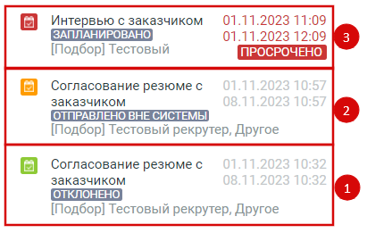

Название рисунка
:::

Рисунок
2. **Раздел «Сведения»** (1) содержит информацию по вакансии, доступную
  для просмотра HR сотруднику, информацию о резервистах, изменения
  по вакансии, календарь с отмеченными событиями подбора,
  добавленными на вакансию.

 -   На вкладке «Основная информация» (2) содержится информация о
     вакансии: информация о должности, на которую ведется поиск,
     условия работы, требования к кандидатам и т.д.

:::{figure-md} mirapolis-image-008

Название рисунка
:::

- На вкладке «Описание вакансии» (1) HR сотрудник может заполнить
  описание компании и вакансии для отправки кандидату.

:::{figure-md} mirapolis-image-009

Название рисунка
:::

- На вкладке «Воронка подбора» (1) для каждого типа событий подбора отображаются кандидаты, которые принимали участие в данном событии подбора.

:::{figure-md} mirapolis-image-010

Название рисунка
:::

- На вкладке «Статусы» (1) содержится информация о всех статусах, в которых находилась вакансия, кто изменял статус вакансии, начало и окончание нахождения вакансии в статусе и т.д.

:::{figure-md} mirapolis-image-011

Название рисунка
:::

- На вкладке «Ответственные» (1) содержится информация об
  ответственных по вакансии HR сотрудниках, когда и кем они были
  назначены и т.д.

:::{figure-md} mirapolis-image-012

Название рисунка
:::

- Вкладка «Автоотклонение» (1) предназначена для настройки правил, по
  которым кандидат автоматически будет отклоняться с вакансии
  автоматически при отборе на вакансию, если он ей не соответствует
  (инструкцию по настройке смотрите далее в п. 5.4.).

:::{figure-md} mirapolis-image-013

Название рисунка
:::

3. **Раздел «Публикация вакансии»** (1) содержит описание вакансии для публикации на различных работных сайтах, ссылки на уже существующие публикации и сведения об откликах на вакансию.

- На вкладке «Описание для публикации» (2) содержится описание
  вакансии в нескольких форматах, соответствующих требованиям
  наиболее популярных работных сайтов ( ([hh.ru](https://hh.ru/),  [superjob.ru](https://www.superjob.ru/)) ) и типовое
  описание вакансий.

:::{figure-md} mirapolis-image-014

Название рисунка
:::

- На вкладке «Публикация вакансии» (1) содержится информация о
  публикациях, созданных для данной вакансии: сайт, на котором она
  была опубликована, дата начала и окончания действия публикации,
  ссылка на саму публикацию и т.д.

:::{figure-md} mirapolis-image-015

Название рисунка
:::

- На вкладке «Отклики» (1) содержится информация об откликах,
  полученных на вакансию с работных сайтов: информация о кандидате,
  дата, когда был получен отклик, откуда был получен отклик и т.д.

:::{figure-md} mirapolis-image-016

Название рисунка
:::

4. **Раздел «Календарь»** (1) представляет собой календарь, в котором отображаются события подбора, добавленные в календарь Outlook.

:::{figure-md} mirapolis-image-017

Название рисунка
:::

5. **Раздел «Приложения»** (1) содержит все файлы, которые прикладывались вручную или были сформированы, или приложены автоматически в Системе по всем кандидатам на вакансии.

:::{figure-md} mirapolis-image-018

Название рисунка
:::

6. **Раздел «Дополнительно»** (1) содержит дополнительную информацию о вакансии, которая может потребоваться HR сотруднику:

 -   Вкладка «Доступ» (2) нужна для ограничения доступа к вакансии
      определенному количеству сотрудников.

:::{figure-md} mirapolis-image-019

Название рисунка
:::

- Вкладка «Наблюдатели» (1) позволяет указать пользователей, которые
  не являются ответственными по вакансии, но при этом которые должны
  видеть активность по вакансии.
 :::{figure-md} mirapolis-image-020

Название рисунка
:::

- Вкладка «Кандидаты» (1) содержит список всех кандидатов, отобранных
  на вакансию и краткую информацию по ним: ФИО, контакты, резюме и
  их текущий статус на вакансии.

:::{figure-md} mirapolis-image-021

Название рисунка
:::

- Вкладка «События» (1) содержит список всех событий, добавленных по
  всем кандидатам на вакансии: название с ссылкой на карточку
  события, дата начала события, инициатор и т.д.

:::{figure-md} mirapolis-image-022

Название рисунка
:::

- Вкладка «Журнал изменений» (1) содержит информацию о том, кем и
  когда была изменена карточка вакансии. Если нажать на кнопку
  «Показать все изменения» (3), то откроется журнал (3), в котором
  зафиксированы любые изменения во всех полях карточки вакансии,
  которые когда-либо были изменены.

:::{figure-md} mirapolis-image-023

Название рисунка
:::

- Вкладка «Изменения (1) содержит информацию о том, кем и когда была
  создана вакансия и кем и когда последний раз была изменена
  карточка вакансии.

:::{figure-md} mirapolis-image-024

Название рисунка
:::

+++

### Карточка кандидата

В карточке кандидата HR сотруднику доступна следующая информация:
1. **Атрибуты кандидата** -- специфические признаки, отличающие
  кандидата: информация о последнем месте работы и должности,
  желаемый уровень з/п, основное образование, личные данные и
  контакты, а также специальные навыки, которыми обладает кандидат
  (метки) (1).
2. **Блок работы с кандидатом на вакансии** (2) -- содержит информацию
  по активностям по кандидату: события, приложения и комментарии.
  Также в этом блоке содержится информация о том, на какие вакансии
  отобран кандидат.

3. **Раздел «Резюме»** (3) содержит само резюме и информацию по нему:

 -   На вкладке «Резюме» можно просмотреть само резюме, а также:

 -   Скачать резюме на ПК, нажав на название резюме (7). При этом
     резюме будет выгружено в том же формате, в котором оно было
     загружено в систему.

 -   Распечатать резюме, нажав на кнопку «Распечатать» (5). При этом
     в новом окне откроется предпросмотр резюме и характеристики для
     печати.

 -   Сохранить изменения (6), если в текст резюме HR сотрудник вносил
     правки.

:::{figure-md} mirapolis-image-025

Название рисунка
:::

- Вкладка «Версии резюме» (1) содержит все версии резюме, которые были
  загружены в карточку кандидата, и сохраненные HR сотрудником
  версии резюме после редактирования.

:::{figure-md} mirapolis-image-026

Название рисунка
:::

4. **Раздел «Сведения»** (1) содержит подробную информацию о кандидате,
  доступную для просмотра сотруднику, в т.ч. опыт работы и
  образование.

 -   На вкладке «Основная информация» (2) содержится личная
      информация о кандидате, его навыки и умения, требования к
      должности и т.п.

:::{figure-md} mirapolis-image-027

Название рисунка
:::

- На вкладке «Места работы» (1) содержится информация обо всех местах
  работы кандидата: название компании, должности, дата начала и
  окончания и др.

:::{figure-md} mirapolis-image-028
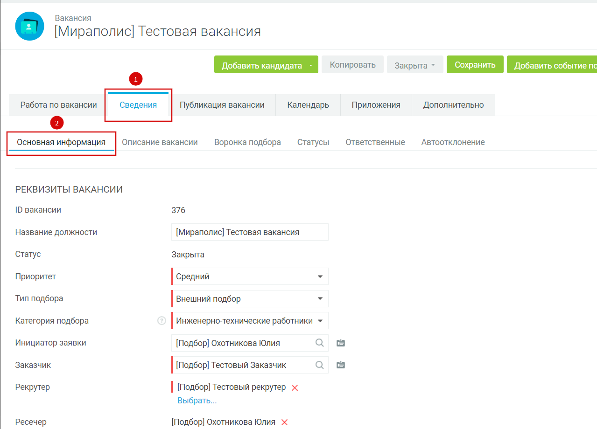

Название рисунка
:::

- На вкладке «Образование» (1) содержится информация обо всех видах
  основного и дополнительного образования, полученного кандидатом
  (университет, курсы повышения квалификации, переподготовка и
  т.п.): наименование учебного учреждения, тип образования, дата
  окончания и др.

:::{figure-md} mirapolis-image-029
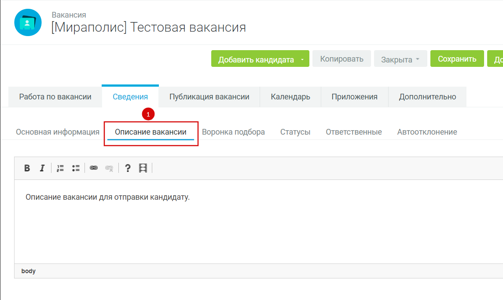

Название рисунка
:::

- На вкладке «Пользовательские данные» (1) содержится информация о
  пользователе, созданном на основе кандидата.

:::{figure-md} mirapolis-image-030
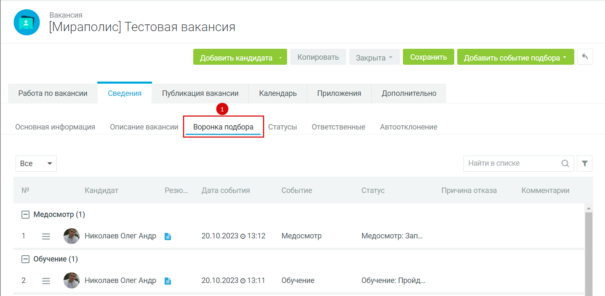

Название рисунка
:::

- На вкладке «Согласие на обработку ПДн» (1) содержится информация о
  тексте согласия на обработку персональных данных, принятого
  кандидатом в событии подбора «Согласие на обработку персональных
  данных».

:::{figure-md} mirapolis-image-031
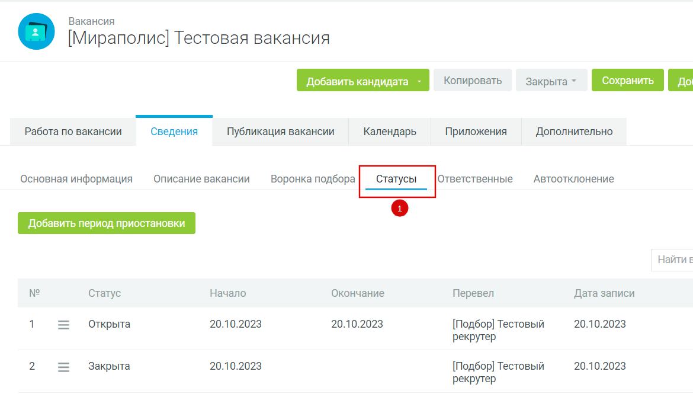

Название рисунка
:::

5. **Раздел «Работа с кандидатом»** (1) содержит информацию о том,
  какая работа велась по кандидату по всем вакансиям, на которые он
  был отобран.

 -   На вкладке «Вакансии» (2) содержится список вакансий, на которые
      отобран кандидат и в каком состоянии находится кандидат на
      этой вакансии.

:::{figure-md} mirapolis-image-032
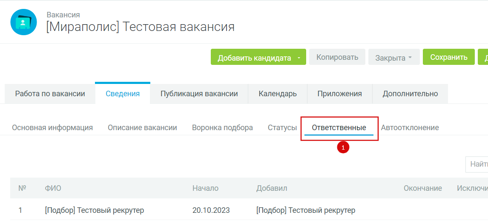

Название рисунка
:::

- На вкладке «События» (1) содержится список всех событий подбора,
  добавленных кандидату по всем вакансиям, на которые он отобран:
  дата начала и окончания событий, кем было создано событие и т.д.

:::{figure-md} mirapolis-image-033
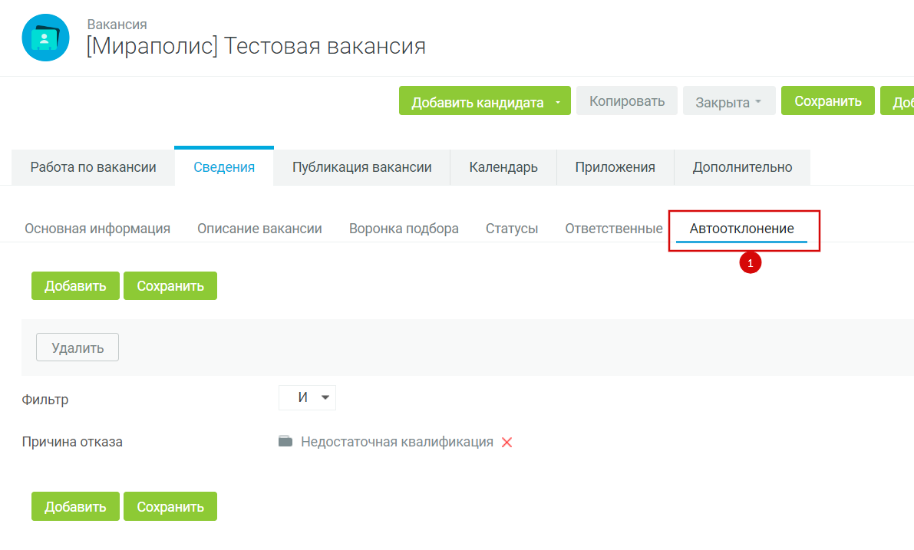

Название рисунка
:::

- На вкладке «Статусы» (1) содержится информация обо всех статусах
  кандидата, которые были ему присвоены за все время подбора:
  статус, кем и когда был присвоен, в рамках какого события и т.д.

:::{figure-md} mirapolis-image-034
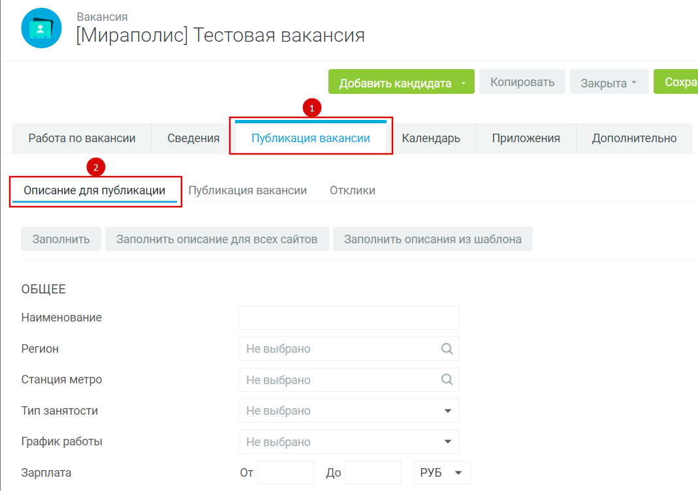

Название рисунка
:::

6. **Раздел «Мероприятия»** (1) содержит список системных мероприятий,
  на которые был записан кандидат.

:::{figure-md} mirapolis-image-035
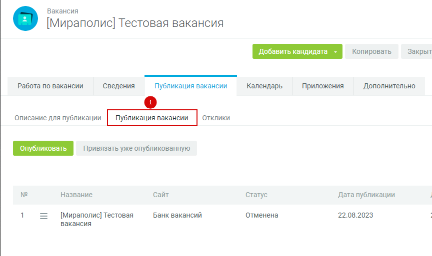

Название рисунка
:::
7. **Раздел «Документы»** (1) содержит все приложения, которые были
  добавлены в рамках событий подбора.

:::{figure-md} mirapolis-image-036
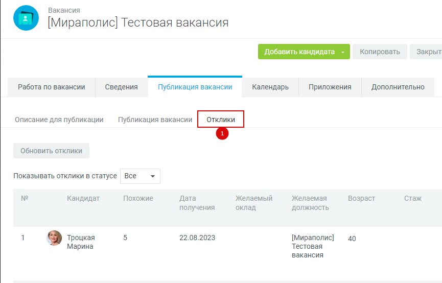

Название рисунка
:::

8. **Раздел «Дополнительно»** (1) содержит дополнительную информацию о карточке кандидата, которая может потребоваться HR сотруднику:

 -   Вкладка «Доступ» (2) нужна для ограничения доступа к кандидату
      определенному кругу сотрудников:

:::{figure-md} mirapolis-image-037
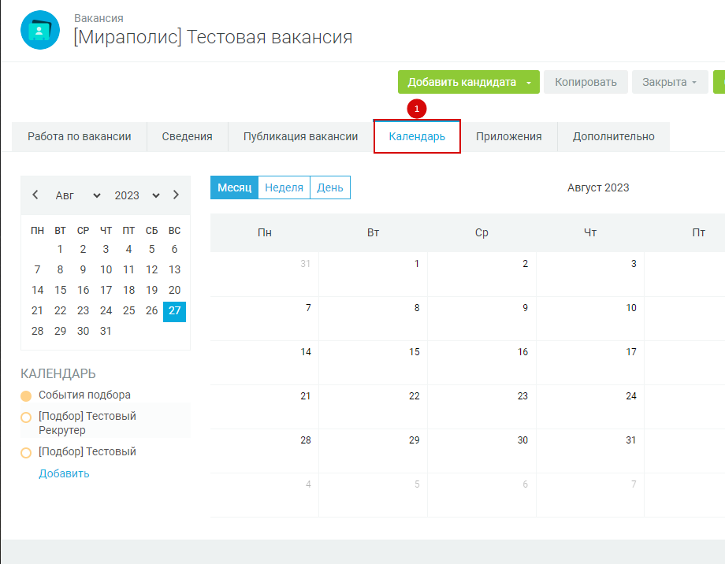

Название рисунка
:::

- Вкладка «Родительские группы» (1) содержит список всех статических
  групп, в которые входит кандидат.

:::{figure-md} mirapolis-image-038
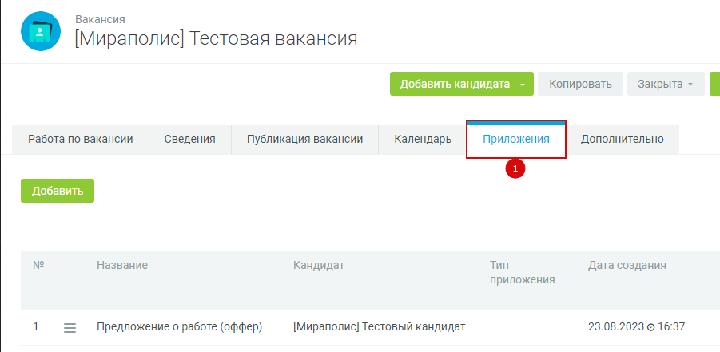

Название рисунка
:::

- Вкладка «Журнал изменений» (1) содержит информацию о том, кем и
  когда была изменена карточка кандидата. Если нажать на кнопку
  «Показать все изменения», то откроется журнал (2), в котором
  зафиксированы любые изменения во всех полях карточки кандидата,
  которые когда-либо были изменены.

:::{figure-md} mirapolis-image-039
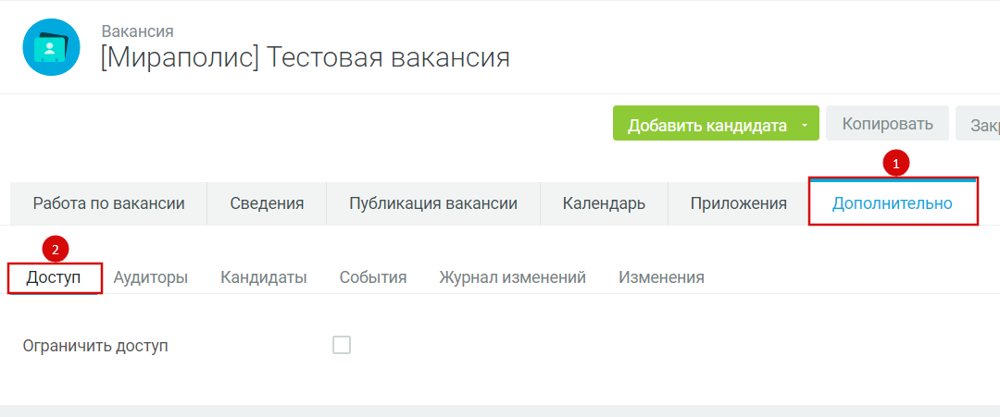

Название рисунка
:::

:::{figure-md} mirapolis-image-040
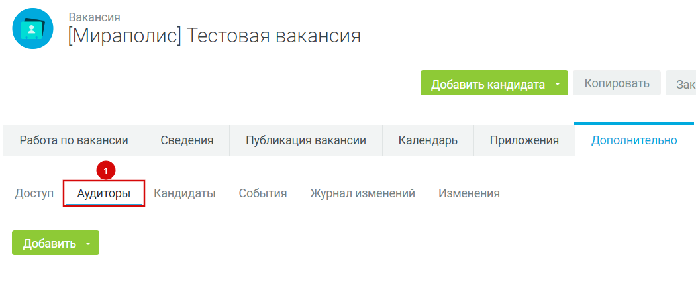

Название рисунка
:::

- Вкладка «Изменения (1) содержит информацию о том, кем и когда была
  создана карточка кандидата и кем и когда последний раз была
  изменена карточка кандидата.

:::{figure-md} mirapolis-image-041
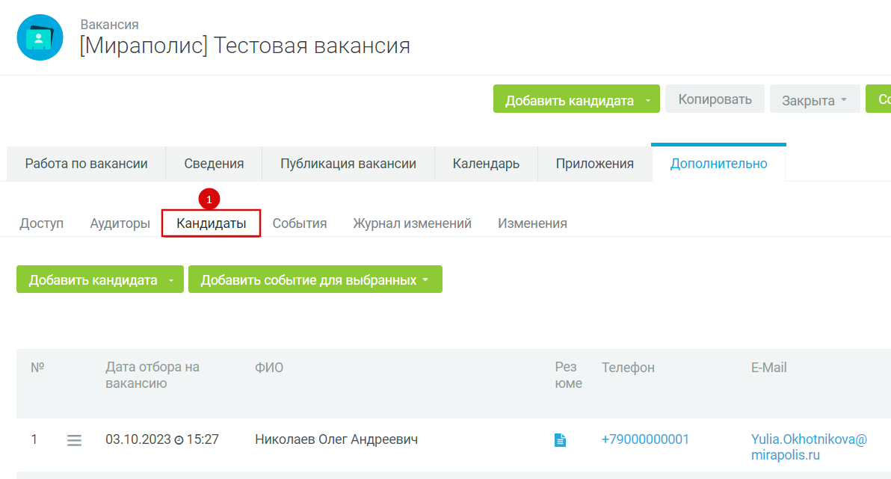

Название рисунка
:::
