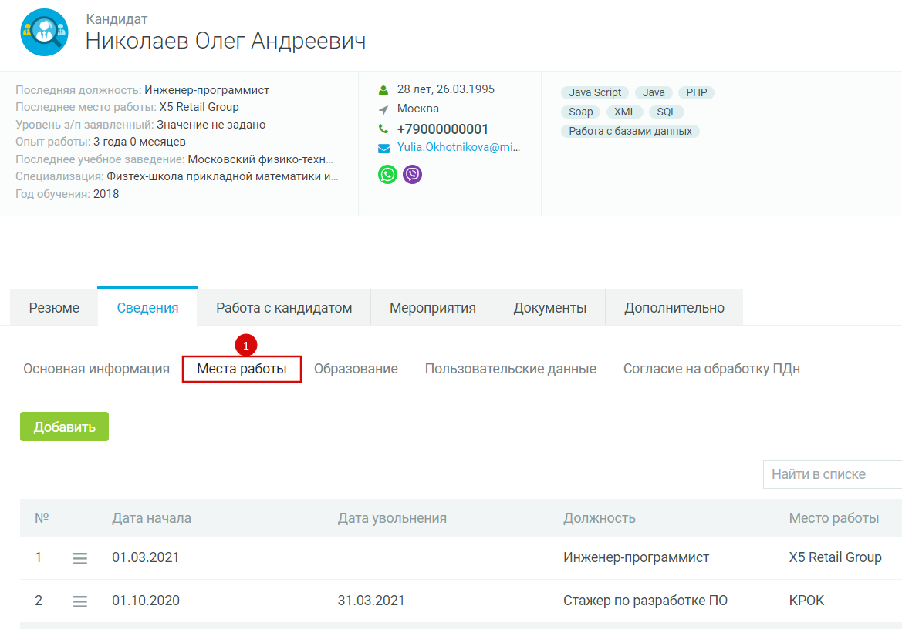

---
jupytext:
  text_representation:
    extension: .md
    format_name: myst
kernelspec:
  display_name: Python 3
  language: python
  name: python3
---

(mirapolis_ch01)=
# Создание заявки на подбор персонала

+++

## Общее описание

Как только принимается решение о том, что требуется подбор на какую-либо
должность, то необходимо создать в Системе заявку на подбор персонала.

В Системе заявка на подбор создается каждый раз, если:

- требуется замена уволившегося сотрудника;

- возникла декретная ставка

- по причине перевода действующего сотрудника на другую должность

- введение новой штатной единицы

Заявка на подбор не создается в случае так называемых «технических»
переводов, когда, к примеру: меняется наименование должности или
подразделения.

+++

## Как начать формировать заявку на подбор

Перейти в пункт меню «Заявки» (1):

:::{figure-md} mirapolis-image-042

Название рисунка
:::

Откроется раздел «Заявки». Вверху раздела выбрать один из вариантов
формирования заявки на подбор:

- «Добавить заявку» (1). Этот вариант выбирается, если заявка создается впервые, ранее не создавались похожие заявки, в списке шаблонов нет шаблона, подходящего для должности. При выборе данного варианта потребуется заполнять все поля заявки с нуля. Рекомендуется перед созданием заявки проверить доступные шаблоны и ранее сделанные заявки на подбор.

:::{figure-md} mirapolis-image-043

Название рисунка
:::

- «Скопировать заявку из существующей» (2). Этот вариант выбирается, если ранее создавались заявки для должности, на которую требуется подбор. Это позволит избежать необходимости заполнять поля заявки повторно, будет достаточно скорректировать несколько полей. При выборе данного варианта откроется список ранее созданных вами заявок на подбор. Далее потребуется выбрать соответствующую заявку, на основании которой будет заведена новая.

:::{figure-md} mirapolis-image-044

Название рисунка
:::

- «Создать заявку по шаблону» (3). Этот вариант выбирается, если подбор требуется на типичную должность, для которой разработан шаблон. Это позволит избежать необходимости заполнять поля заявки с нуля, будет достаточно дополнить и скорректировать несколько полей.
 При выборе данного варианта откроется список доступных шаблонов заявок. Далее потребуется выбрать шаблон, наиболее подходящий для должности.

:::{figure-md} mirapolis-image-045

Название рисунка
:::

После нажатия на одну из кнопок откроется окно добавления заявки на
подбор. Необходимо заполнить все доступные поля. После этого нажать
кнопку Далее (1).

:::{figure-md} mirapolis-image-046

Название рисунка
:::

После нажатия на кнопку Далее откроется карточка добавления заявки на
подбор. Необходимо заполнить поля заявки. Затем нажать на одну из
кнопок:

- Сохранить (1). Создается новая заявка на подбор. Заявка находится на этапе «Черновик».

- Отправить на согласование (2). Создается новая заявка на подбор.
 Заявка отправляется на дальнейшее согласование (см. п. 4).

- Отменить (3). Заявка на подбор отменяется. Заявка остается доступной только для просмотра ранее введенных данных.

:::{figure-md} mirapolis-image-047

Название рисунка
:::

Обращаем ваше внимание, что некоторые поля заявки неактивны. Это
означает, что данные были добавлены автоматически и они не подлежат
исправлению, дополнению и т.п. Пример неактивных полей указан ниже:

:::{figure-md} mirapolis-image-048

Название рисунка
:::

Пример доступных для заполнения и корректировки полей заявки указан
ниже:

:::{figure-md} mirapolis-image-049

Название рисунка
:::

При этом часть активных полей являются обязательными для заполнения.
Данные поля отмечены красной линией.

:::{figure-md} mirapolis-image-050

Название рисунка
:::

Ниже в Таблице 1 указаны поля заявки на подбор и пояснения к их
заполнению.

Таблица 1

+---+-----------------+-------------------------+---------------------+
|   | Наименование    | Описание поля           | Требования к        |
|   | поля            |                         | запол               |
|   |                 |                         | нению/корректировке |
+===+=================+=========================+=====================+
| 1 | **РЕКВИЗИТЫ     |                         |                     |
| . | ВАКАНСИИ**      |                         |                     |
|   |                 |                         |                     |
|   |                 |                         |                     |
+---+-----------------+-------------------------+---------------------+
| 1 | Номер заявки    | При создании каждой     | Номер присваивается |
| . |                 | заявке присваивается    | автоматически.      |
|   |                 | порядковый номер заявки |                     |
|   |                 | в Системе               |                     |
+---+-----------------+-------------------------+---------------------+
| 2 | Вакансии        | Отображаются вакансии,  | Отображаются        |
| . |                 | созданные или связанные | автоматически.      |
|   |                 | с данной заявкой на     |                     |
|   |                 | подбор                  |                     |
+---+-----------------+-------------------------+---------------------+
| 3 | Наименование    | В заявке указывается    | Заполняется вручную |
| . | вакансии        | название должности, на  | пользователем.      |
|   |                 | которую ведется подбор  |                     |
|   |                 |                         |                     |
+---+-----------------+-------------------------+---------------------+
| 4 | Статус          | Отображается текущий    | Статус назначается  |
| . |                 | статус заявки на подбор | автоматически.      |
|   |                 |                         |                     |
|   |                 |                         |                     |
+---+-----------------+-------------------------+---------------------+
| 5 | Тип вакансии    | Отображается тип        | Автоматически       |
| . |                 | вакансии для данной     | присваивается тип   |
|   |                 | заявки на подбор        | «Внешний подбор».   |
|   |                 |                         |                     |
+---+-----------------+-------------------------+---------------------+
| 6 | Категория       | Подбор реализуется на   | Заполняется вручную |
| . | подбора         | следующие категории:    | пользователем.      |
|   |                 |                         |                     |
|   |                 | -   Руководители TOP    |                     |
|   |                 |                         |                     |
|   |                 | -   Руководители middle |                     |
|   |                 |                         |                     |
|   |                 | -                       |                     |
|   |                 |   Инженерно-технические |                     |
|   |                 |     работники           |                     |
|   |                 |                         |                     |
|   |                 | -   Офисные специалисты |                     |
|   |                 |                         |                     |
|   |                 | -   Рабочие             |                     |
|   |                 |                         |                     |
|   |                 | -   Линейный персонал   |                     |
|   |                 |                         |                     |
|   |                 | -                       |                     |
|   |                 |  Низкоквалифицированный |                     |
|   |                 |     персонал            |                     |
+---+-----------------+-------------------------+---------------------+
| 1 | Плановая дата   | Предполагаемая дата     | Заполняется вручную |
| . | взятия в работу | взятия в работу заявки  | руководителем       |
|   |                 | на подбор рекрутером    | подбора при         |
|   |                 |                         | распределении       |
|   |                 |                         | заявки в работу.    |
+---+-----------------+-------------------------+---------------------+
| 2 | Приоритет       | Приоритет вакансии      | Заполняется вручную |
| . |                 | подразделяется на       | руководителем       |
|   |                 | следующие категории:    | подбора при         |
|   |                 |                         | распределении       |
|   |                 | -   Высокий             | заявки в работу.    |
|   |                 |                         |                     |
|   |                 | -   Средний             |                     |
|   |                 |                         |                     |
|   |                 | -   Низкий              |                     |
+---+-----------------+-------------------------+---------------------+
| 2 | **СОГЛАСУЮЩИЕ** |                         |                     |
| . |                 |                         |                     |
|   |                 |                         |                     |
|   |                 |                         |                     |
+---+-----------------+-------------------------+---------------------+
| 1 | Инициатор       | Пользователь, создавший | Инициатор заявки    |
| . |                 | заявку на подбор        | указывается         |
|   |                 |                         | автоматически.      |
|   |                 |                         |                     |
+---+-----------------+-------------------------+---------------------+
| 2 | Заказчик        | Сотрудник, являющийся   | Заполняется         |
| . |                 | заказчиком вакансии     | автоматически       |
|   |                 |                         | пользователем,      |
|   |                 |                         | создающим заявку.   |
|   |                 |                         | Может быть изменено |
|   |                 |                         | вручную             |
|   |                 |                         | пользователем.      |
+---+-----------------+-------------------------+---------------------+
| 3 | Руководитель    | Сотрудник, отвечающий   | Заполняется         |
| . | подбора         | за согласование и       | автоматически по    |
|   |                 | распределение заявок на | центру подбора.     |
|   |                 | подбор, контроль за     |                     |
|   |                 | движением по вакансии и |                     |
|   |                 | кандидатам              |                     |
+---+-----------------+-------------------------+---------------------+
| 4 | Рекрутер        | Сотрудник,              | Заполняется         |
| . |                 | ответственный за подбор | автоматически по    |
|   |                 | кандидатов на вакансию  | направлению         |
|   |                 |                         | структурного        |
|   |                 |                         | подразделения.      |
|   |                 |                         | Может быть изменено |
|   |                 |                         | вручную             |
|   |                 |                         | руководителем       |
|   |                 |                         | подбора при         |
|   |                 |                         | распределении       |
|   |                 |                         | заявки в работу.    |
+---+-----------------+-------------------------+---------------------+
| 5 | Ресечер         | Сотрудник, помогающий в | Заполняется вручную |
| . |                 | подборе кандидатов на   | руководителем       |
|   |                 | вакансию                | подбора или         |
|   |                 |                         | рекрутером.         |
+---+-----------------+-------------------------+---------------------+
| 6 | Соисполнители   | Сотрудники, являющиеся  | Заполняется вручную |
| . |                 | соисполнителями по      | руководителем       |
|   |                 | вакансии.               | подбора или         |
|   |                 |                         | рекрутером.         |
+---+-----------------+-------------------------+---------------------+
| 3 | **ОПИСАНИЕ      |                         |                     |
| . | ВАКАНСИИ**      |                         |                     |
|   |                 |                         |                     |
|   |                 |                         |                     |
+---+-----------------+-------------------------+---------------------+
| 1 | Компания        | Головная организация, в | Заполняется         |
| . | Работодателя    | которую подбирается     | автоматически по    |
|   |                 | кандидат                | выбранному          |
|   |                 |                         | структурному        |
|   |                 |                         | подразделению       |
+---+-----------------+-------------------------+---------------------+
| 2 | Направление     | Направление             | Заполняется         |
| . |                 | деятельности            | автоматически       |
|   |                 | структурного            | направлением        |
|   |                 | подразделения           | подразделения       |
|   |                 |                         | пользователя,       |
|   |                 |                         | создающего заявку.  |
|   |                 |                         | Может быть изменено |
|   |                 |                         | вручную             |
|   |                 |                         | пользователем       |
+---+-----------------+-------------------------+---------------------+
| 3 | Короткое        | Описание компании для   | Заполняется         |
| . | продающее       | представления кандидату | автоматически       |
|   | описание        |                         | описанием компании  |
|   | компании        |                         | пользователя,       |
|   | Работодателя    |                         | создающего заявку.  |
|   |                 |                         | Может быть изменено |
|   |                 |                         | вручную             |
|   |                 |                         | пользователем       |
+---+-----------------+-------------------------+---------------------+
| 4 | Структурное     | Структурное             | Заполняется         |
| . | подразделение/  | подразделение, в        | автоматически       |
|   | Компания        | которое подбирается     | структурным         |
|   | Работодателя    | кандидат                | подразделением, в   |
|   |                 |                         | которое входит      |
|   |                 |                         | пользователь,       |
|   |                 |                         | создающий заявку.   |
|   |                 |                         | Может быть изменено |
|   |                 |                         | вручную             |
|   |                 |                         | пользователем       |
+---+-----------------+-------------------------+---------------------+
| 5 | Должность       | Должность, на которую   | Заполняется вручную |
| . |                 | подбирается кандидат    | пользователем       |
|   |                 |                         |                     |
|   |                 |                         |                     |
+---+-----------------+-------------------------+---------------------+
| 6 | Н               | Сотрудник, являющийся   | Заполняется         |
| . | епосредственный | непосредственным        | автоматически       |
|   | руководитель    | руководителем будущего  | пользователем,      |
|   |                 | сотрудника              | создающим заявку.   |
|   |                 |                         | Может быть изменено |
|   |                 |                         | вручную             |
|   |                 |                         | пользователем       |
+---+-----------------+-------------------------+---------------------+
| 7 | П               | Профессиональная        | Заполняется вручную |
| . | рофессиональная | область, к которой      | пользователем       |
|   | область         | относится деятельность  |                     |
|   |                 | будущего сотрудника     |                     |
+---+-----------------+-------------------------+---------------------+
| 8 | Количество      | Необходимое количество  | Заполняется вручную |
| . | человек на      | сотрудников для подбора | пользователем       |
|   | данную вакансию | на должность.           |                     |
|   |                 |                         |                     |
+---+-----------------+-------------------------+---------------------+
| 9 | Причина         | Причина открытия        | Заполняется вручную |
| . | открытия        | вакансии по данной      | пользователем       |
|   | вакансии        | заявке на подбор        |                     |
|   |                 |                         |                     |
+---+-----------------+-------------------------+---------------------+
| 1 | Основные        | Текстовое описание      | Заполняется вручную |
| 0 | задачи,         | основных должностных    | пользователем       |
| . | проекты,        | обязанностей, требуемых |                     |
|   | должностные     | для выполнения работы   |                     |
|   | обязанности     | будущим сотрудником     |                     |
+---+-----------------+-------------------------+---------------------+
| 1 | Преимущества    | Текстовое описание      | Заполняется вручную |
| 1 | работы для      | преимуществ работы для  | пользователем       |
| . | кандидата       | кандидат                |                     |
|   |                 |                         |                     |
+---+-----------------+-------------------------+---------------------+
| 4 | **ТРЕБОВАНИЯ К  |                         |                     |
| . | КАНДИДАТУ**     |                         |                     |
|   |                 |                         |                     |
|   |                 |                         |                     |
+---+-----------------+-------------------------+---------------------+
| 1 | Требования к    | Текстовое описание      | Заполняется вручную |
| . | кандидатам      | требований,             | пользователем       |
|   |                 | предъявляемых к         |                     |
|   |                 | кандидатам              |                     |
+---+-----------------+-------------------------+---------------------+
| 2 | Образование     | Требуемый уровень       | Заполняется вручную |
| . |                 | образования для         | пользователем       |
|   |                 | должности               |                     |
|   |                 |                         |                     |
+---+-----------------+-------------------------+---------------------+
| 3 | Опыт работы     | Требуемый опыт работы   | Заполняется вручную |
| . |                 | для должности           | пользователем       |
|   |                 |                         |                     |
|   |                 |                         |                     |
+---+-----------------+-------------------------+---------------------+
| 4 | Личностные      | Предпочтительный список | Заполняется вручную |
| . | качества        | личностных качеств,     | пользователем       |
|   |                 | необходимых для         |                     |
|   |                 | должности               |                     |
+---+-----------------+-------------------------+---------------------+
| 5 | Дополнительные  | Текстовое описание      | Заполняется вручную |
| . | комментарии     | требований к кандидату, | пользователем       |
|   |                 | не вошедших в рамках    |                     |
|   |                 | других требований       |                     |
+---+-----------------+-------------------------+---------------------+
| 6 | П               | Требуемый список        | Заполняется вручную |
| . | рофессиональные | профессиональных        | пользователем       |
|   | компетенции     | компетенций кандидата   |                     |
|   |                 |                         |                     |
+---+-----------------+-------------------------+---------------------+
| 7 | Требования к    | Перечень сертификатов,  | Заполняется вручную |
| . | наличию         | которые должны быть в   | пользователем       |
|   | сертификатов    | наличии у кандидата.    |                     |
|   |                 |                         |                     |
+---+-----------------+-------------------------+---------------------+
| 8 | Навыки работы с | Описание требований к   | Заполняется вручную |
| . | ПК (конкретные  | наличию у кандидата     | пользователем       |
|   | программы и     | навыков работы с        |                     |
|   | уровни          | конкретными программами |                     |
|   | владения)       | на ПК                   |                     |
+---+-----------------+-------------------------+---------------------+
| 9 | Знание          | Перечень иностранных    | Заполняется вручную |
| . | иностранных     | языков и уровней их     | пользователем       |
|   | языков          | владения, требуемых для |                     |
|   |                 | вакансии                |                     |
+---+-----------------+-------------------------+---------------------+
| 1 | Ключевые слова  | Текстовое описание      | Заполняется вручную |
| 0 | для поиска      | ключевых слов,          | пользователем       |
| . | данного         | способствующих поиску   |                     |
|   | специалиста     | подходящего кандидата   |                     |
|   |                 | на вакансию             |                     |
+---+-----------------+-------------------------+---------------------+
| 1 | Метки           | Набор меток,            | Заполняется вручную |
| 1 |                 | соответствующих         | пользователем       |
| . |                 | требованиям к кандидату |                     |
|   |                 |                         |                     |
+---+-----------------+-------------------------+---------------------+
| 5 | **УСЛОВИЯ       |                         |                     |
| . | РАБОТЫ**        |                         |                     |
|   |                 |                         |                     |
|   |                 |                         |                     |
+---+-----------------+-------------------------+---------------------+
| 1 | График работы   | Требуемый тип графика   | Заполняется вручную |
| . |                 | работы для данной       | пользователем       |
|   |                 | вакансии                |                     |
|   |                 |                         |                     |
+---+-----------------+-------------------------+---------------------+
| 2 | Дополнительная  | Текстовое описание      | Заполняется вручную |
| . | информация по   | графика работы для      | пользователем       |
|   | графику работы  | должности               |                     |
|   |                 |                         |                     |
+---+-----------------+-------------------------+---------------------+
| 3 | Место работы    | Местоположение рабочего | Заполняется вручную |
| . |                 | места будущего          | пользователем       |
|   |                 | сотрудника              |                     |
|   |                 |                         |                     |
+---+-----------------+-------------------------+---------------------+
| 4 | Ежемесячный     | Диапазон возможного     | Заполняется вручную |
| . | оклад до уплаты | ежемесячного оклада     | пользователем       |
|   | налогов         | будущего сотрудника в   |                     |
|   |                 | рублях до уплаты        |                     |
|   |                 | налогов                 |                     |
+---+-----------------+-------------------------+---------------------+
| 5 | Стимулирующие   | Текстовое описание      | Заполняется вручную |
| . | выплаты         | выплат стимулирующего   | пользователем       |
|   | (премии)        | характера               |                     |
|   |                 |                         |                     |
+---+-----------------+-------------------------+---------------------+
| 6 | Социальный      | Текстовое описание      | Заполняется вручную |
| . | пакет для       | социальных льгот и      | пользователем       |
|   | сотрудника      | компенсаций             |                     |
|   |                 |                         |                     |
+---+-----------------+-------------------------+---------------------+
| 7 | KPI (оценка     | Описание                | Заполняется вручную |
| . | ре              | соответствующих         | пользователем       |
|   | зультативности) | ключевых показателей    |                     |
|   |                 | эффективности           |                     |
+---+-----------------+-------------------------+---------------------+
| 8 | П               | Текстовое описание      | Заполняется вручную |
| . | рофессиональное | возможностей            | пользователем       |
|   | развитие        | профессионального       |                     |
|   |                 | развития сотрудника на  |                     |
|   |                 | данной должности        |                     |
+---+-----------------+-------------------------+---------------------+
| 9 | Порядок         | Текстовое описание      | Заполняется вручную |
| . | прохождения     | порядка прохождения     | пользователем       |
|   | собеседования   | собеседования для       |                     |
|   |                 | данной вакансии         |                     |
+---+-----------------+-------------------------+---------------------+
| 1 | Вложение        | Прикрепление файлов     | Заполняется вручную |
| 0 |                 | различных типов,        | пользователем       |
| . |                 | имеющие отношение к     |                     |
|   |                 | вакансии                |                     |
+---+-----------------+-------------------------+---------------------+
