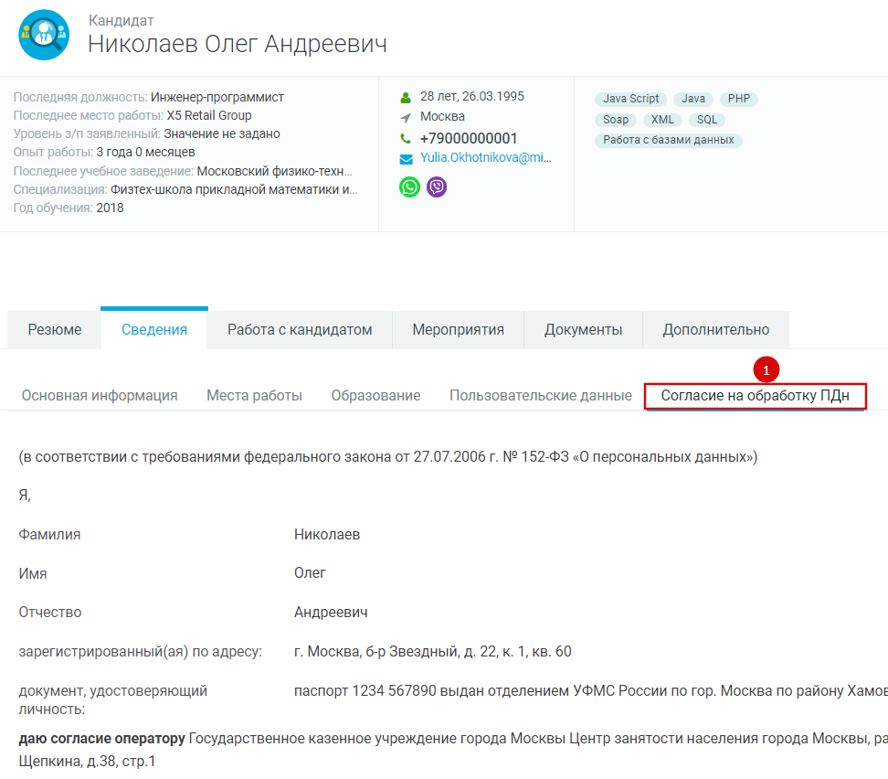
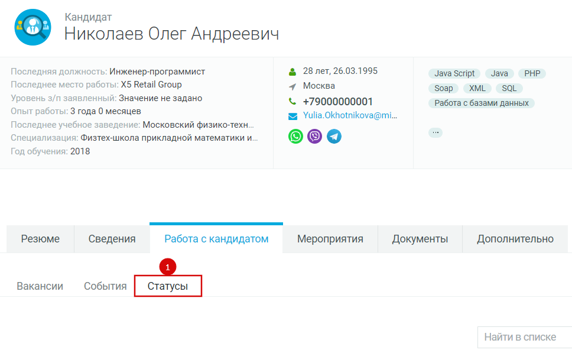
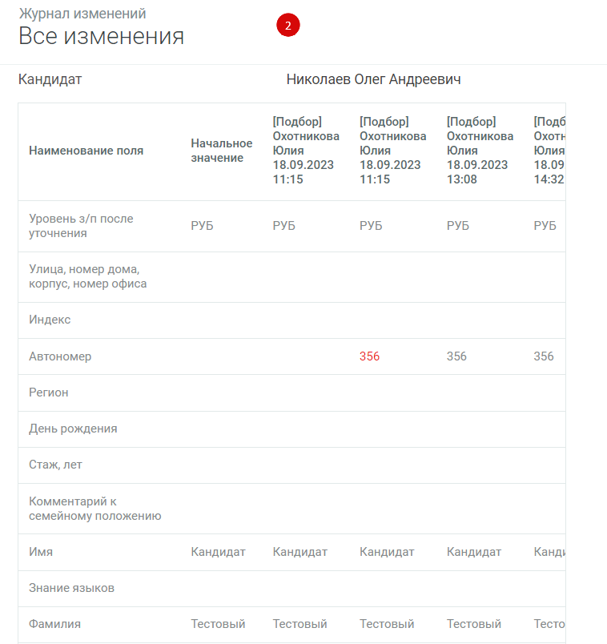
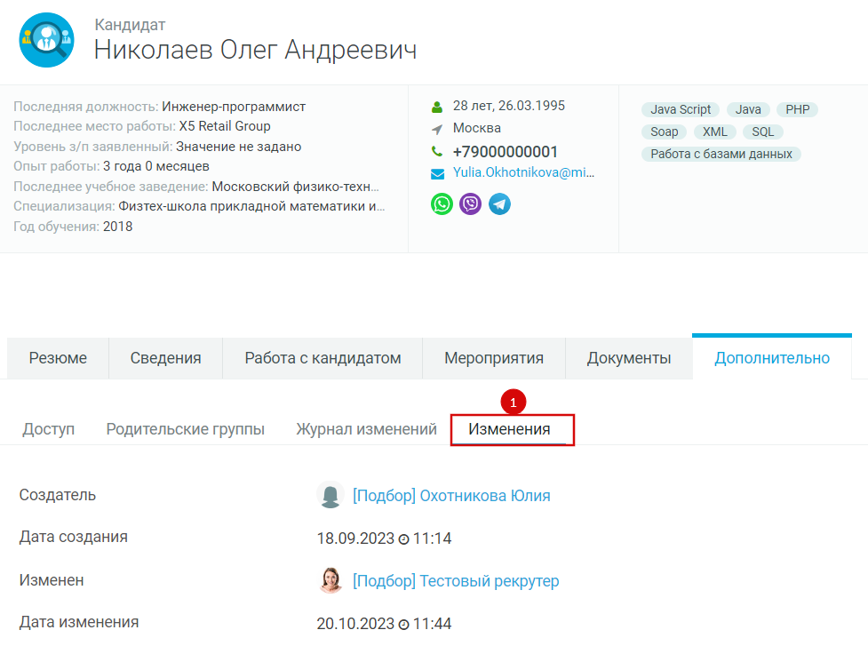
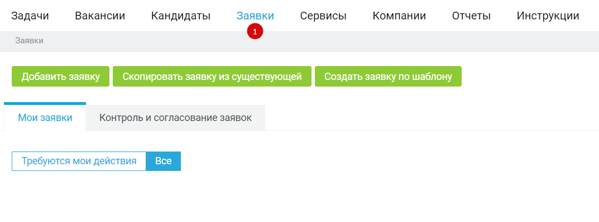

---
jupytext:
  text_representation:
    extension: .md
    format_name: myst
kernelspec:
  display_name: Python 3
  language: python
  name: python3
---

(mirapolis_ch03)=
# Проставление решения по заявке на подбор персонала

+++

## Общее описание

В рамках согласования заявки на подбор персонала Вы также можете быть
назначены согласующим на каком-либо из этапов.

Чтобы проставить решение по заявке на подбор персонала, нужно открыть
заявку на подбор персонала:

Вариант 1: Из уведомления: зайти в систему и перейти на страницу
«Уведомления» («колокольчик» в правом вернем углу экрана), открыть
уведомление, нажать на ссылку в уведомлении.

:::{figure-md} mirapolis-image-051

Название рисунка
:::

Вариант 2: Из личного кабинета: зайти в систему и перейти в пункт меню
«Заявки (1), перейти на вкладку «Контроль и согласование заявок» (2),
нажмите на название заявки (3).

:::{figure-md} mirapolis-image-052

Название рисунка
:::

При необходимости на каждом этапе рассмотрения заявки на подбор за
согласующих решение может проставить Администратор подбора.

+++

## Распределение в работу Руководителем подбора

После перехода в карточку заявки (см. п. 4.1) заполните поля.
Обязательные для заполнения поля отмечены красной линией. После
заполнения полей нажать на кнопку «Распределить» (1).

:::{figure-md} mirapolis-image-053

Название рисунка
:::

Откроется модальное окно для указания рекрутера. Заполните обязательные
поля, отмеченные красной линией. При необходимости добавьте ресечера,
соисполнителей, комментарий. Нажмите на кнопку «Сохранить» (1).

:::{figure-md} mirapolis-image-054

Название рисунка
:::

+++

## Взятие в работу Рекрутером

После перехода в карточку заявки (см. п. 4.1.) заполните поля.
Обязательные для заполнения поля отмечены красной линией. После
заполнения полей нажмите на кнопку «Взять в работу» (1):

:::{figure-md} mirapolis-image-055

Название рисунка
:::

Статус заявки на подбор изменится на «В работе». На основе данных заявки
на подбор сформируется новая вакансия со статусом «Открыта».

+++

## Отмена заявки на подбор персонала

После перехода в карточку заявки (см. п. 4.1.) заполните поля.
Обязательные для заполнения поля отмечены красной линией. После
заполнения полей нажмите на кнопку «Отменить» (1):

:::{figure-md} mirapolis-image-056

Название рисунка
:::

Появится модальное окно для обязательного указания причины отмены.
Заполните поля и нажмите на кнопку «Сохранить» (1):

:::{figure-md} mirapolis-image-057

Название рисунка
:::

Статус заявки на подбор будет изменен на «Отменена». Если по заявке на
подбор ранее была создана вакансия, связанная вакансия также перейдет в
статус «Отменена».

+++

## Изменение требований в заявке на подбор

После согласования заявки на подбор и создания вакансии при
необходимости есть возможность изменить условия в заявке на подбор.
Внести изменения может Заказчик и Инициатор. При изменении полей текущая
вакансия обновится с новыми значениями.

Для изменения полей в заявке на подбор нужно:
1. Перейти в пункт меню «Заявки» (1) на вкладку «Контроль и согласование заявок» вкладка «Все» (2). Затем перейти на карточку заявки на подбор (3), которая согласована и распределена в работу:

:::{figure-md} mirapolis-image-058

Название рисунка
:::

2. На карточке заявки на подбор нажмите на кнопку «Внести корректировки» (1):

:::{figure-md} mirapolis-image-059

Название рисунка
:::

3. Откроется модальное окно, в котором поля заявки станут доступны для редактирования. Внесите изменения в нужные поля и нажмите на кнопку
 «Сохранить» (1):

:::{figure-md} mirapolis-image-060

Название рисунка
:::

4. После сохранения окно редактирования закроется, данные в заявке на подбор и вакансии обновятся в соответствии с изменениями.

+++

## Приостановление/возобновление работы по вакансии

При необходимости работу по вакансии можно приостановить через связанную
заявку на подбор. Для этого:
1. Перейти в пункт меню «Заявки» (1) на вкладку «Контроль и согласование заявок» вкладка «Все» (2). Затем перейти на карточку заявки на подбор (3), которая согласована и распределена в работу:

:::{figure-md} mirapolis-image-058

Название рисунка
:::

2. Нажмите на кнопку «Приостановить» (1):

:::{figure-md} mirapolis-image-061

Название рисунка
:::

3. Статус заявки на подбор и связанной вакансии изменится на
 «Приостановлена». Рекрутеру придет уведомление о приостановке работы по вакансии.

Для возобновления работы по вакансии нужно:
1. Перейти на карточку заявки на подбор, по которой была приостановлена работа.
2. Нажмите на кнопку «Возобновить» (1):

:::{figure-md} mirapolis-image-062

Название рисунка
:::

3. Статус заявки на подбор сменится на «В работе». Статус связанной вакансии сменится на «Открыта». Рекрутеру придет уведомление о возобновлении работы по вакансии.